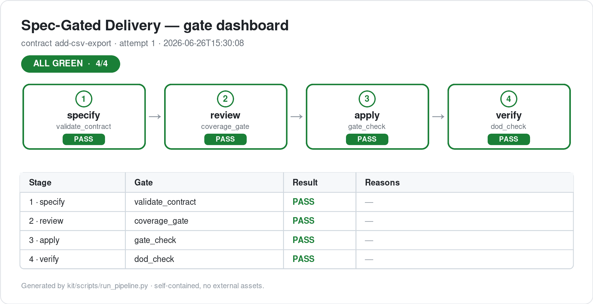

# agent-delivery-kit

[](https://github.com/SinboBoop/agent-delivery-kit/actions/workflows/ci.yml)    

> **Spec-Gated Delivery** — a stack-agnostic, reusable workflow for shipping work with AI agents through four gated stages, where every gate is judged by a deterministic script, not by the model's own say-so.



---

## What it is

Naive "let the agent code" workflows drift: the model skips steps, marks things done that aren't, and you find out late. `agent-delivery-kit` fixes that by turning delivery into a **contract-driven, gated loop**:

```
intent ─▶ ① SPECIFY ─▶ ② REVIEW ─▶ ③ APPLY ─▶ ④ VERIFY ─▶ ship
              │            │            │            │
         contract.json  coverage    gate-check    dod-check
          (machine-      gate       (no code      (evidence
           readable)                 before gate)  before claims)
                          └──────── red ◀──────────┘
```

## The four stages

| Stage | Input | Output | Gate (script-judged) |
|-------|-------|--------|----------------------|
| **① Specify** | intent, sources | structured spec + machine-readable `contract.json` | `validate_contract.py` — schema valid, no placeholders |
| **② Review** | spec + contract + sources | structured review + coverage signal | `coverage_gate.py` — does the contract faithfully cover the sources? |
| **③ Apply** | contract + rule sources | implementation | `gate_check.py` — pre-implementation gates all done before editing code |
| **④ Verify** | implementation + evidence | Definition-of-Done verdict | `dod_check.py` — acceptance green + zero open tasks + tests really passed |

## The five invariants

1. **Single source of truth** — rules live once under `kit/shared/`, referenced not copied.
2. **Machine-readable contract handoff** — stage ① emits the contract that stage ③ consumes; design and implementation stay decoupled.
3. **Deterministic gates** — the model cannot self-certify; the scripts decide.
4. **Composition over duplication** — orchestrators only call skills, never reimplement them.
5. **Derived artifacts excluded** — indexes, caches, runtime state are `.gitignore`d.

## Repo layout

```
agent-delivery-kit/
├── docs/         # article, concepts, architecture, cookbook, adapting guide
├── kit/          # the runnable scaffold
│   ├── skills/   # specify · review · apply · verify (portable SKILL.md)
│   ├── shared/   # contract schema, rule sources, definition of done
│   ├── commands/ # thin entrypoints
│   ├── scripts/  # 4 gate scripts + record_evidence + run_pipeline + stdlib tests (Python 3, zero deps)
│   ├── extensions/  # optional: dual-track governance, pipeline-driver
│   └── context-map.yaml
└── examples/     # sample + bad contract, worked feature / bug-fix, and a measured-mode walkthrough
```

## Quickstart

```bash
# from this repo — point $ADK at the kit, then run the self-tests (no deps)
export ADK="$PWD/kit"
python3 -m unittest discover -s "$ADK/scripts/tests" -p "test_*.py"

# watch the gates reject a bad contract, then accept a good one
python3 "$ADK/scripts/validate_contract.py" examples/contract.bad.json     # FAIL (with reasons)
python3 "$ADK/scripts/dod_check.py"          examples/contract.sample.json  # PASS

# or run all four at once and see the status board
python3 "$ADK/scripts/run_pipeline.py" examples/contract.sample.json        # ALL GREEN (4/4)

# read the method
open docs/article.en.md
```

## Install into your project

Keep the kit as **one folder** so its internal paths (`scripts/`, `shared/`) stay valid — don't
scatter individual skill files.

```bash
cd your-project
cp -r /path/to/agent-delivery-kit/kit .delivery     # 1. drop the kit in as one unit
export ADK="$PWD/.delivery"                          # 2. kit root; gates are "$ADK/scripts/<gate>.py"

# 3. let your agent discover the skills WITHOUT copying them out (keeps ../../shared valid):
#    Preferred — point your agent's skills path straight at .delivery/skills
#    Fallback (if your agent can't add a skills path) — symlink it in:
#      ln -s ../../.delivery/skills .codex/skills/adk     # Claude Code: .claude/skills/adk

# 4. CI: copy the workflow and adjust paths
cp /path/to/agent-delivery-kit/.github/workflows/ci.yml .github/workflows/
```

The skills are plain `SKILL.md` + `scripts/` — the same shape Codex and Claude/Anthropic skills use.
Each skill calls its gate as `"$ADK/scripts/…"` and reads rules via `../../shared/…`, so **pointing
your agent at the skills folder (or symlinking it) — not flattening it — keeps both valid.** Then fill
`.delivery/shared/rule-sources.md` with your team's rules.

## Orchestrate & visualize

Run all four gates over a contract and see where it stands — optionally with a self-contained HTML
dashboard and a machine-readable result:

```bash
python3 "$ADK/scripts/run_pipeline.py" path/to/contract.json \
  --max-attempts 5 --retry-delay 10 --report report.html --json run.json
```

The terminal prints a status board; `report.html` is a shareable gate dashboard (no external assets).
`--max-attempts` re-loads the contract each try, so an agent or human fixing it between attempts is
picked up, and the run stops as soon as every gate is green. New here? walk a full feature or bug fix
in [`examples/`](examples/), and read [`docs/cookbook.md`](docs/cookbook.md) for contract best
practices and how to extend the gates.

## Trustworthy completion: declared vs. measured evidence

A gate is only as honest as the evidence it reads. `dod_check.py` checks fields like
`tests.passed` — and by default those fields are *declared* (whoever wrote the contract set
them). That's fine for local iteration, but the model could write `tests.passed: true` without a
real run. **Measured mode** closes that gap by moving evidence production out of the model:

```bash
# CI (not the model) runs the suite and stamps real evidence onto the contract...
python3 "$ADK/scripts/record_evidence.py" contract.json --test-command "pytest -q" --verify
#   → runs the command, writes tests/acceptance from the real exit code, adds evidence.source=runner
# ...then the DoD gate refuses anything the runner didn't attest:
python3 "$ADK/scripts/dod_check.py" contract.json --require-measured
```

`--require-measured` rejects a contract unless its evidence carries `source: "runner"` and the
`tests.passed` value still agrees with the recorded return code — so a self-attested or
after-the-fact-edited contract cannot pass. Command resolution is `--test-command` >
`$ADK_TEST_COMMAND` > `verification.test_command`, so **CI pins what runs**, not the contract.
Make the `dod_check --require-measured` step a required status check and the gate becomes real
enforcement, not advice. Worked end to end in [`examples/measured/`](examples/measured/).

For the review stage, `coverage_gate.py --strict` adds the same idea to coverage: every
`must_cover` source needs a *substantive, testable* criterion, plus a reviewer two-key
(`review.coverage_substantive`) the implementing model may not set for itself. A script can prove
a source is *referenced*; it can't prove the coverage is *faithful* — that judgement stays with a
human or a separate reviewer, by design.

## How this differs

Deliberately a **micro-kit**: four stages, four ~30-line gate scripts, zero dependencies — not a
framework. Versus larger spec-driven tools (e.g. GitHub's Spec Kit), the bet is **smaller + more
auditable + deterministic gates**: the thing that decides "done" is a script you can read in a minute
and run in CI, not a prompt. The optional `run_pipeline.py` adds a status board and a self-contained
HTML dashboard — still no framework and no services. Use it on its own, or as the gate layer beside a
heavier spec tool.

## Adapting to your stack

The 4 skills and 4 gates contain **no language/framework specifics**. To adopt: copy `kit/` into your repo, fill `kit/shared/rule-sources.md` with your team's rules, extend `kit/shared/contract-schema.md` with your domain fields, and wire the gate scripts into your CI. See [`docs/adapting-to-your-stack.md`](docs/adapting-to-your-stack.md).

## License

MIT — see [LICENSE](LICENSE).
