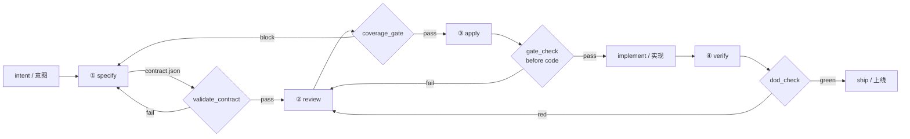
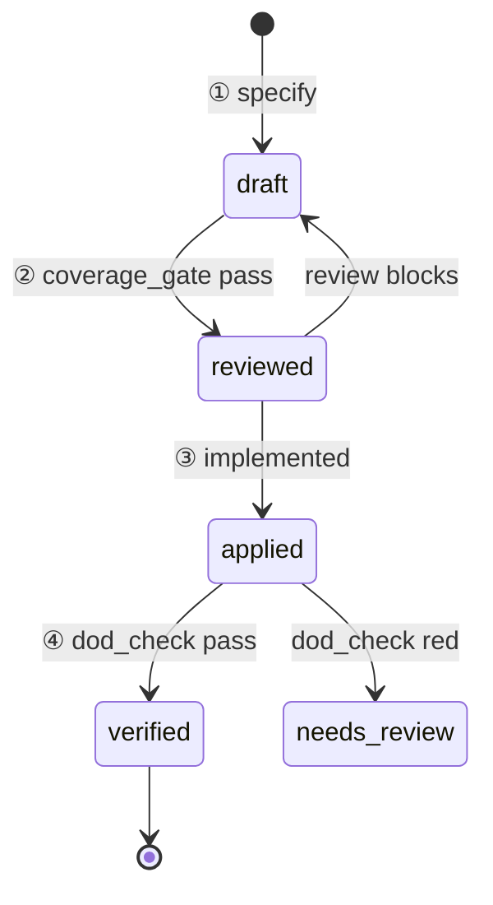
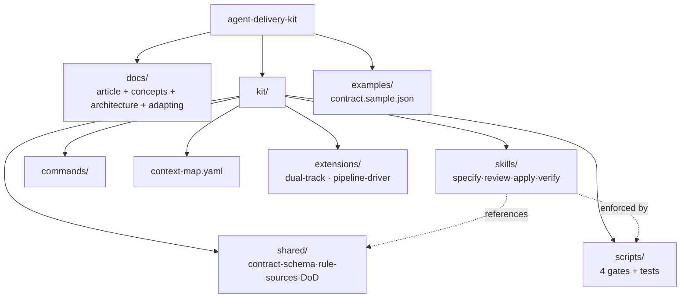

# Architecture / 架构

## Stage flow / 阶段流

## Contract status lifecycle / 契约状态机

## Repo map / 仓库地图

> The contract is authoritative; `context-map.yaml` is navigation only. /
> 契约是事实源;`context-map.yaml` 只做导航。
