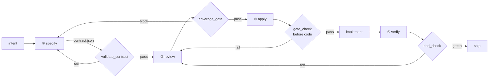
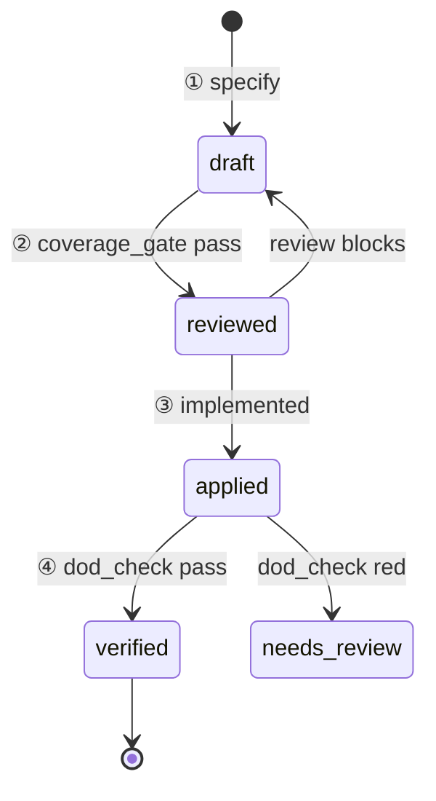
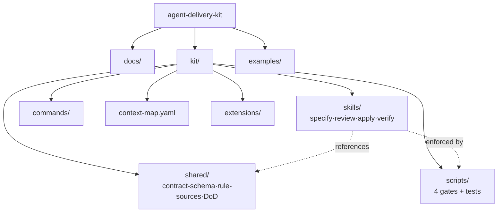

# Architecture

## Stage flow

```mermaid
flowchart LR
  I[intent] --> S1[① specify]
  S1 -->|contract.json| G1{validate_contract}
  G1 -->|pass| S2[② review]
  G1 -->|fail| S1
  S2 --> G2{coverage_gate}
  G2 -->|pass| S3[③ apply]
  G2 -->|block| S1
  S3 --> G3{gate_check<br/>before code}
  G3 -->|pass| IMPL[implement]
  G3 -->|fail| S2
  IMPL --> S4[④ verify]
  S4 --> G4{dod_check}
  G4 -->|green| SHIP[ship]
  G4 -->|red| S2
```

## Contract status lifecycle

```mermaid
stateDiagram-v2
  [*] --> draft: ① specify
  draft --> reviewed: ② coverage_gate pass
  reviewed --> applied: ③ implemented
  applied --> verified: ④ dod_check pass
  applied --> needs_review: dod_check red
  reviewed --> draft: review blocks
  verified --> [*]
```

## Repo map

```mermaid
flowchart TD
  ROOT[agent-delivery-kit] --> DOCS[docs/]
  ROOT --> KIT[kit/]
  ROOT --> EX[examples/]
  KIT --> SK[skills/<br/>specify·review·apply·verify]
  KIT --> SH[shared/<br/>contract-schema·rule-sources·DoD]
  KIT --> CM[commands/]
  KIT --> SC[scripts/<br/>4 gates + tests]
  KIT --> CMAP[context-map.yaml]
  KIT --> EXT[extensions/]
  SK -. references .-> SH
  SK -. enforced by .-> SC
```

> The contract is authoritative; `context-map.yaml` is navigation only.
